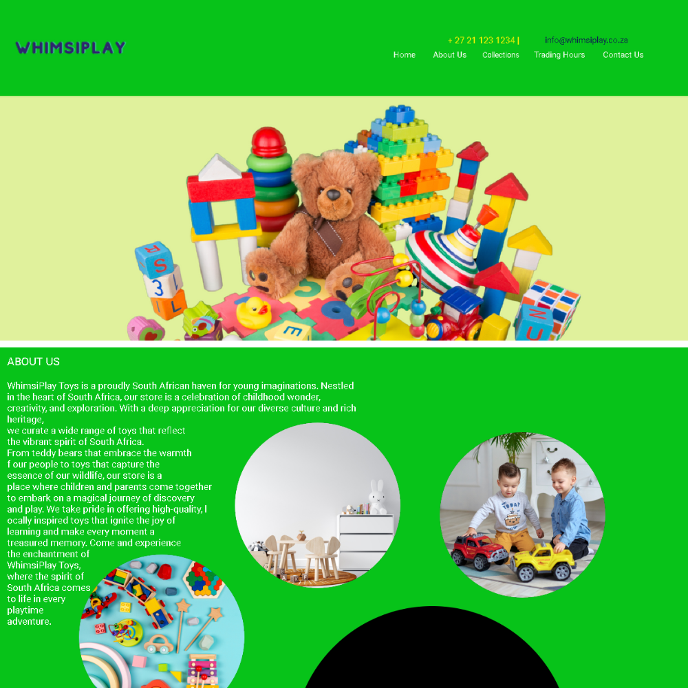
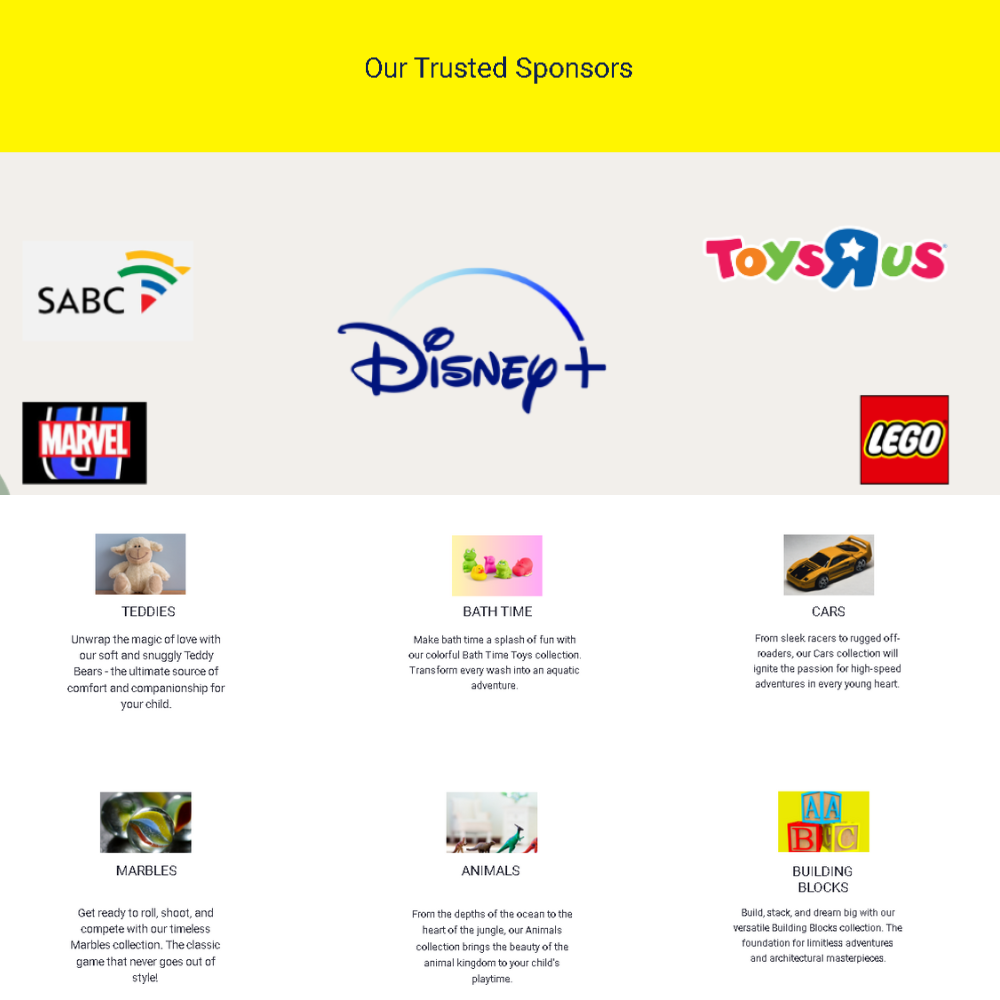
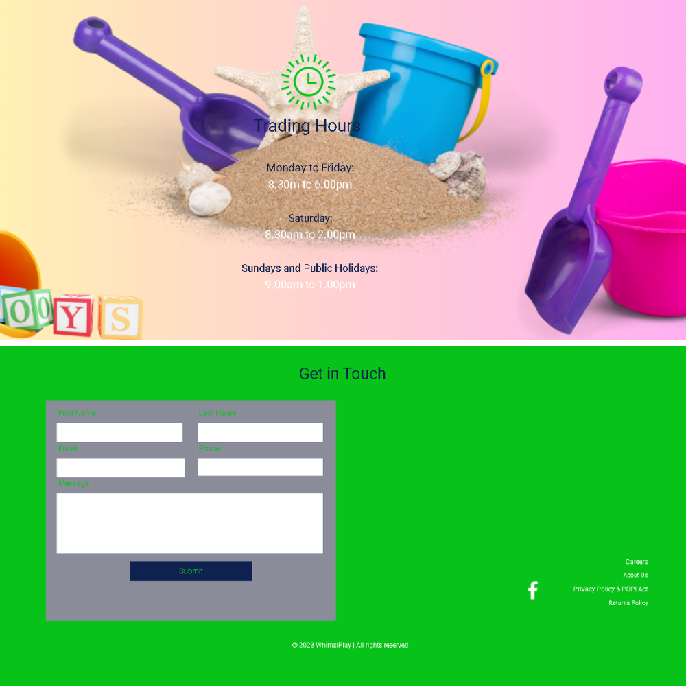

# WhimsiPlay Toy Store

Welcome to WhimsiPlay, your go-to destination for delightful toys! 🎉

## Table of Contents
- [About](#about)
- [Navigation](#navigation)
- [Returns Policy](#returns-policy)
- [Contact Information](#contact-information)

## About

WhimsiPlay is an online toy store that brings joy to kids and families with a curated selection of high-quality toys. Explore our collections and find the perfect playmates for your little ones. 🚀

## Navigation

### Header Navigation
- **Home**: [Go to Landing Page](https://maltsh.github.io/WhimsiPlay/)
- **About Us**: [About Us Page](https://maltsh.github.io/WhimsiPlay/AboutUs/index.html)

### Footer Navigation
- **Careers**: [Explore Career Opportunities](https://maltsh.github.io/WhimsiPlay/Careers/index.html)
- **Privacy & POPI Act**: [Privacy Policy](https://maltsh.github.io/WhimsiPlay/PrivacyPolicy/index.html)
- **Returns Policy**: [Returns Policy](https://maltsh.github.io/WhimsiPlay/ReturnsPolicy/index.html)

## Returns Policy

Our returns policy ensures a smooth experience for our customers. Please refer to the [Returns Policy Page](https://maltsh.github.io/WhimsiPlay/ReturnsPolicy/index.html) for detailed information on returns, exchanges, and non-returnable items. 📦

## Contact Information

For any inquiries or assistance, feel free to reach out to us:

- **Email**: info@whimsiplay.com
- **Phone**: +1 (123) 456-7890

We appreciate your visit to WhimsiPlay and hope you find the perfect toys for your little ones! 🐶🐱

## See Site Below

## Contributing 🤝

If you have suggestions or find any issues, feel free to open an issue or create a pull request. Contributions are welcome!

## License 📄

This project is licensed under MIT License - see the [LICENSE](LICENSE) file for details.

## Show Your Support ⭐

If you find this project useful, consider giving it a star on GitHub. It's a small gesture that means a lot!

⭐ [Star this Repository](https://maltsh.github.io/WhimsiPlay/)

